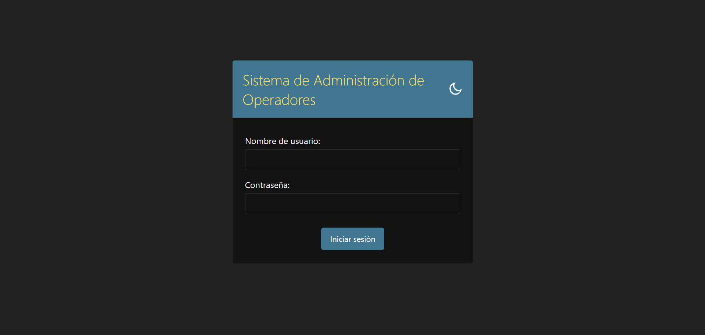
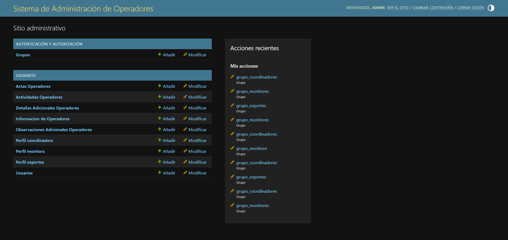

## 📝 Sistema de Administración de Operadores

Este proyecto es un sistema web desarrollado en Django para la gestión integral de operadores y actas electorales. Permite administrar la información de los distintos roles involucrados en el proceso de Resultados Electorales Preliminares, incluyendo operadores, coordinadores, monitores y personal de soporte informático, así como sus actividades y observaciones.

---
### 🎯 Objetivo

---
El objetivo principal del sistema es centralizar la información de los operadores y sus responsables a cargo, así como facilitar el seguimiento de actividades e incidencias, ofreciendo un acceso rápido y eficiente a la información.

---
### ⚙️ Funcionalidades Principales
---
- **Gestión de Operadores:** Registro completo de operadores con sus datos personales y de contacto, además de la relación con coordinadores, monitores y personal de soporte, y control de actas asignadas y seguimiento de transmisión de datos.

- **Actas y Mesas:** Administración de actas por provincia, municipio, localidad y recinto, incluyendo el registro de resultados de mesas y detalles adicionales.

- **Observaciones Adicionales y Actividades:** Permite agregar incidencias sobre los operadores, así como registrar si cumplieron con las actividades asignadas en su rol para asegurar una correcta transmisión de datos.

- **Exportación de Datos:** Generación de reportes en Excel de operadores, actas y observaciones, con la posibilidad de realizar consultas personalizadas mediante SQL y exportarlas.
  
- **Panel de Administración Personalizado:** Interfaz de Django Admin adaptada con mejoras de usabilidad, incorporando múltiples filtros de búsqueda para facilitar la localización rápida y precisa de los registros.

---
### 📋 Vista previa de algunas secciones
---

---

